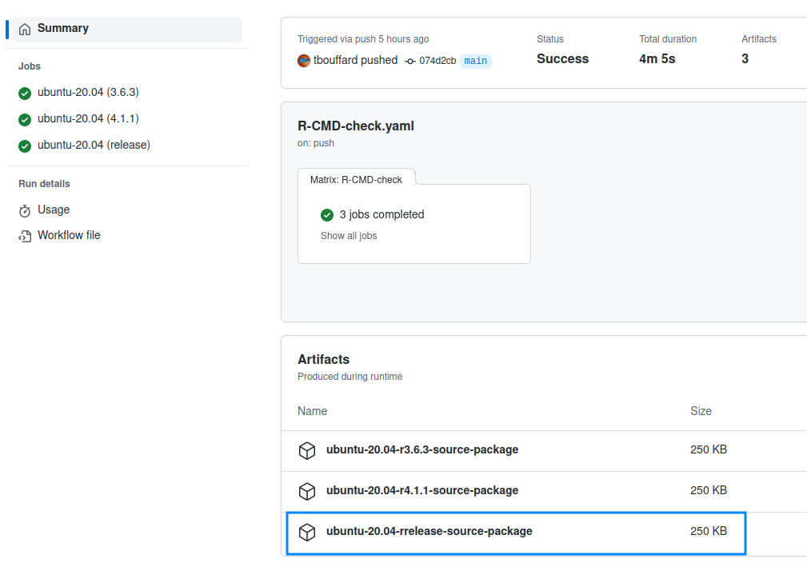

# Maintainers

The information provided here are for the maintainers of the project. Contributors should read the [Contributing Guide](./CONTRIBUTING.md) instead.

## Merging a Pull Request

A PR can only be merged into master by a maintainer, if all of these conditions are met:

- The CI Checks are passing.
- It has been approved by at least two maintainers. If it was a maintainer who opened the PR, only one extra approval is needed.
- It has no requested changes.
- It is up-to-date with current `main` branch.

## Release process

Maintainers need to perform the following actions **in the order described here** to push out a release.

### GitHub issues and milestones update

**Note:** we always put issues related to a version in a Milestone whose name matches the version.

- Ensure the name of the milestone used for the new release version matches the name of the tag/version that is going to be released. Renamed it if needed.
- Clean this opened milestone if some issues are still opened (move them to a new one or discard milestone from them).
- Close the milestone.
- Create a new milestone for the next version if it does not already exist.

### Prepare the GitHub Release Notes

- Open [GitHub releases](https://github.com/process-analytics/bpmn-visualization-R/releases)
- Create a new draft release and name it `Next` (the name is not relevant and will be replaced automatically later).
  This ensures that development can continue without impacting the writing of the content of the in progress release. That way,
  if a PR is merged, `release-drafter` will update the `Next` draft release keeping the in-progress release untouched.
- The draft release for the newly tagged version should already exist:
  - [release-drafter](https://github.com/release-drafter/release-drafter) creates or updates draft release for the
    next version each time a pull request is merged to the `master` branch.
  - create a new release if it is missing or rename the existing one to match.
- Ensure that `This is a pre-release` is unchecked (except if we are releasing alpha, beta, rc, ...)

### Initiate the Release

- Open the [Release GitHub Actions](https://github.com/process-analytics/bpmn-visualization-R/actions/workflows/release.yml)
- Click on the 'Run workflow' dropdown located on the right side of the page
- Provide parameter value for New version type (default is patch, but you can choose one of the [major | minor | patch])
- Click on the button 'Run workflow'
- Make sure job execution was successful by checking the status
- The new git tag should have been created and available on GitHub

___

### Manual procedure

⚠️⚠️⚠️ _**Only if the GitHub job that publish the npm package fails after manual re-run!**_  ⚠️⚠️⚠️

#### Verify the version in files

Check that the files are using the version to be released:
- [DESCRIPTION](./DESCRIPTION)
- [README](./README.md)

Create a new PR (it must have the `skip-changelog` label as we don't want it to appear in the release notes) and merge it,
if some files require changes. The PR/commit message should be `[RELEASE] Set version to x.y.z`.

#### Use a development version

Add the `.9000` suffix to the `Version` field in the [DESCRIPTION](./DESCRIPTION) file to indicate that this is a development version (for more explanations, see the [R documentation](https://r-pkgs.org/release.html#post-release)).  
For instance, if the released version was `0.3.0`, the `Version` field in the `DESCRIPTION` file should be `0.3.O.9000`.

Create a new PR (it must have the `skip-changelog` label as we don't want it to appear in the release notes) and merge it.
The PR/commit message should be `[INFRA] Set the development version to x.y.z.9000`.

___

#### Publish the GitHub Release Notes

- Open the draft release note in [GitHub releases](https://github.com/process-analytics/bpmn-visualization-R/releases)
- In the release description (check previous releases as a source of inspiration)
  - If the bpmn-visualization TypeScript library was updated, add a phrase about it (see [Release 0.2.1](https://github.com/process-analytics/bpmn-visualization-R/releases/tag/v0.2.1) for instance.): `The R package now uses [bpmn-visualization@0.26.2](https://github.com/process-analytics/bpmn-visualization-js/releases/tag/v0.26.2).`
  - put screenshots/gif of the new features.
- At any time, you can save the draft.
- **Only when you are done**:
  - Assign the tag of the new version as release target and save the draft (doing it as later as possible ensure that `release-drafter` doesn't interfer with the writing of the Release Notes)
  - Publish the release.

### Publish the new version on CRAN

**NOTES**:
- CRAN publishing is `in-progress`, see [#10](https://github.com/process-analytics/bpmn-visualization-R/issues/10)
- This is a very manual process today. For improvements, see [#11](https://github.com/process-analytics/bpmn-visualization-R/issues/11)

#### Generate and retrieve the source package

It conforms to [the CRAN Submission policies first](https://cran.r-project.org/web/packages/policies.html#Submission)

- Open [GitHub Actions](https://github.com/process-analytics/bpmn-visualization-R/actions/workflows/R-CMD-check.yaml)
- Find the execution related to the newly created tag
  - If it doesn't exist, click on the 'Run workflow' dropdown located on the right side of the page
  - Choose the **tag that has just been created**, do not use the main branch!
  - Click on the button 'Run workflow'
- Download the source package
  - in the artifact section, choose the source package built with the `r-release` version, as shown in the screenshot below 👇
  - unzip the artifact to retrieve the tar.gz file that will submit be later

#### Do the submission

- Fill all the fields of this [web form](https://xmpalantir.wu.ac.at/cransubmit/), and load `bpmnVisualization_X.Y.Z.tgz` file.
- Submit

## Communicate about the release

**NOTE**: this is a very manual process today. For improvements, see [#130](https://github.com/process-analytics/bpmn-visualization-R/issues/130)

### Twitter

You can use this template:

> 📣 bpmn-visualization R package {version} is out! 🎉
>
> ===> some short description here <===
>
> #bpmnvisualization #bpmn #visualization #R #RLang #programming #opensource
>
> https://github.com/process-analytics/bpmn-visualization-R/releases/tag/v{version}

### Discord

Channel: [news](https://discord.com/channels/1011911769607913562/1024329159033499780)

You can use this template:

> 📣 bpmn-visualization R package {version} is out! 🎉
>
> ===> some short description here <===
>
> https://github.com/process-analytics/bpmn-visualization-R/releases/tag/v{version}
