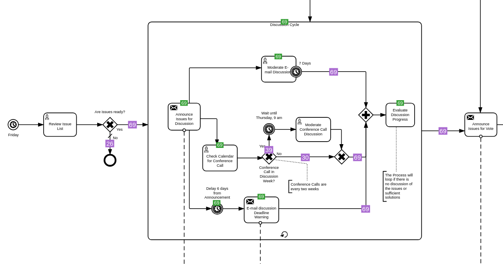

<h1 align="center">BPMN Visualization - R Package</h1>
<div align="center">
    <p align="center"> </p>
    <p align="center">
        <a href="https://github.com/process-analytics/bpmn-visualization-R/releases">
           
        </a>
        <a href="https://github.com/process-analytics/bpmn-visualization-R/actions/workflows/R-CMD-check.yaml">
           
        </a>
        <br>
        <a href="CONTRIBUTING.md">
           
        </a>
        <a href="https://github.com/process-analytics/.github/blob/main/CODE_OF_CONDUCT.md">
           
        </a> 
        <a href="LICENSE">
           
        </a>
    </p>
</div>  
<br>

This project is an R package for visualizing process execution data on BPMN diagrams, using overlays, style customization and interactions.

It is made possible by [htmlwidgets](http://www.htmlwidgets.org/), which provides an easy-to-use framework for bringing together R and the [BPMN Visualization](https://github.com/process-analytics/bpmn-visualization-js) TypeScript library.

## ♻️ Usage
### Installation
Install from GitHub:
```r
devtools::install_github("process-analytics/bpmn-visualization-R")
library(bpmnVisualization)
```

### Load the BPMN file
`bpmnVisualization` accepts a BPMN file (or an XML document):

```r
bpmn_file <- system.file("examples/Email_Voting.bpmn", package = "bpmnVisualization") # File from the package
```

Or
```r
bpmn_file <- file.choose()
```

Or
```r
bpmn_file <- "path_to_bpmn_file"
```

Or
```r
bpmn_file <- "<?xml version="1.0" encoding="UTF-8"?> ...xml_content"
```

💡 The package provides some [BPMN examples](./inst/examples). \
They are taken from the [BPMN 2.0 examples non-normative machine readable files](https://www.omg.org/spec/BPMN/2.0).
- Email_Voting.bpmn
- Nobel_Prize_Process.bpmn
- Order_Process_for_Pizza_V4.bpmn
- Travel_Booking.bpmn

### Display the BPMN diagram
```r
bpmnVisualization::display(bpmn_file)
```


### Display the BPMN diagram with overlays

```r
overlays <- list(bpmnVisualization::create_overlay("bpmn_element_id_1", "42"), bpmnVisualization::create_overlay("bpmn_element_id_2", "9"))
bpmnVisualization::display(bpmn_file, overlays)
```


### Integrate in Shiny Applications

The following displays a BPMN diagram provided as an example by the package with an overlay on top of a BPMN element.

```r
# Install and load packages
install.packages("shiny")
library(shiny)
devtools::install_github("process-analytics/bpmn-visualization-R")
library(bpmnVisualization)

displayBpmn <- function() {
    bpmn_file <- system.file("examples/Travel_Booking.bpmn", package = "bpmnVisualization")
    overlays <- list(bpmnVisualization::create_overlay("_6-203", "9"))
    bpmnVisualization::display(bpmn_file, overlays)
}

ui <- shinyUI(fluidPage(
    titlePanel("Display bpmn diagrams with execution data"),
    bpmnVisualizationOutput('bpmnContainer')
  )
)

server = function(input, output) {
    # renderBpmnVisualization is the R bridge function to the html widgets
    output$bpmnContainer <- renderBpmnVisualization({ displayBpmn() })
}

shinyApp(ui, server)
```

## 🔧 Contributing

To contribute to `bpmn-visualization-R`, fork and clone this repository locally and commit your code on a separate branch. \
Please write tests for your code before opening a pull-request.

You can find more detail in our [Contributing guide](CONTRIBUTING.md). Participation in this open source project is subject to a [Code of Conduct](CODE_OF_CONDUCT.md).

✨ A BIG thanks to all our contributors 🙂

## ⚒️ Development
### Installation
```r
devtools::install()
```

## 📃 License

`bpmn-visualization-R` is released under the [Apache 2.0](LICENSE) license. \
Copyright &copy; from 2021, Bonitasoft S.A.
