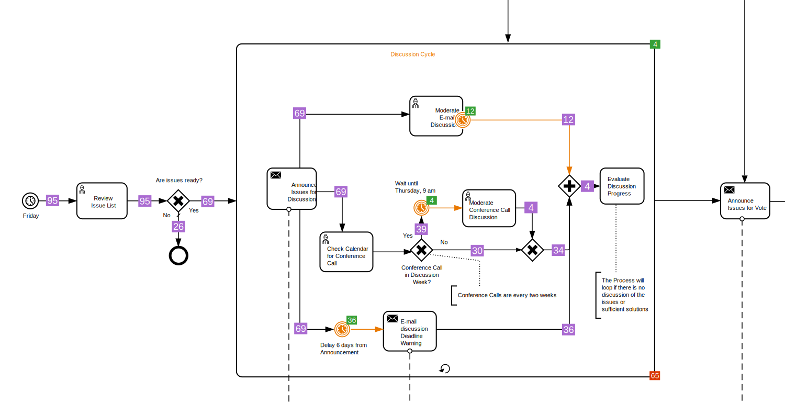

<h1 align="center">bpmnVisualizationR</h1>
<div align="center">
    <p align="center"> </p>
    <p align="center">
        <a href="https://github.com/process-analytics/bpmn-visualization-R/releases">
           
        </a>
        <a href="https://cran.r-project.org/package=bpmnVisualizationR">
           
        </a>
        <a href="https://github.com/process-analytics/bpmn-visualization-R/actions/workflows/R-CMD-check.yaml">
           
        </a>
        <br>
        <a href="CONTRIBUTING.md">
           
        </a>
        <a href="https://github.com/process-analytics/.github/blob/main/CODE_OF_CONDUCT.md">
           
        </a> 
        <a href="LICENSE">
           
        </a>
    </p>
</div>  
<br>

<!-- duplicated with index.md -->
`bpmnVisualizationR` is an R package for visualizing process execution data on BPMN diagrams, using overlays, style customization and interactions.

It is made possible by [htmlwidgets](http://www.htmlwidgets.org/), which provides an easy-to-use framework for bringing together R and the [bpmn-visualization](https://github.com/process-analytics/bpmn-visualization-js) TypeScript library.
<!-- END OF duplicated with index.md -->

## ♻️ Usage
### Installation
#### Install _devtools_  
[Devtools](https://www.rdocumentation.org/packages/devtools) is an R package used to ease the installation and the development of other R packages.  
It can be installed from the R console: 
```r
install.packages('devtools')
```

<!-- duplicated with index.md -->
#### Install _bpmnVisualizationR_

##### From CRAN
The latest stable version of the `bpmnVisualizationR` package can be obtained from [CRAN](https://cran.r-project.org/web/packages/bpmnVisualizationR/index.html) with the command:
```
install.packages("bpmnVisualizationR")
```

##### From GitHub

To install a dedicated version (available versions can be found in the [GitHub releases page](https://github.com/process-analytics/bpmn-visualization-R/releases)), run:
```r
devtools::install_github("process-analytics/bpmn-visualization-R@v0.5.0")
```

Or install the development version:
```r
devtools::install_github("process-analytics/bpmn-visualization-R")
```

Then, make the library available to the current R project:
```r
library(bpmnVisualizationR)
```
<!-- END OF duplicated with index.md -->

### Load the BPMN file
`bpmnVisualizationR` accepts a BPMN file (or an XML document):

```r
# File from the package
bpmn_file <- system.file("examples/Email_Voting.bpmn", package = "bpmnVisualizationR")
```

Or
```r
bpmn_file <- file.choose()
```

Or
```r
bpmn_file <- "path_to_bpmn_file"
```

Or
```r
bpmn_file <- "<?xml version="1.0" encoding="UTF-8"?> ...xml_content"
```

💡 The package provides some [BPMN examples](./inst/examples). \
They are taken from the [BPMN 2.0 examples non-normative machine-readable files](https://www.omg.org/spec/BPMN/2.0).
- Email_Voting.bpmn
- Nobel_Prize_Process.bpmn
- Order_Management.bpmn
- Order_Process_for_Pizza_V4.bpmn
- Travel_Booking.bpmn

### Display the BPMN diagram
```r
bpmnVisualizationR::display(bpmn_file)
```


### Display the BPMN diagram with overlays

```r
overlays <- list(bpmnVisualizationR::create_overlay("bpmn_element_id_1", "42"), 
                 bpmnVisualizationR::create_overlay("bpmn_element_id_2", "9"))
bpmnVisualizationR::display(bpmn_file, overlays)
```

### Style an overlay

```r
style <- bpmnVisualizationR::create_overlay_style(
  font_color = 'WhiteSmoke',
  font_size = 19,
  fill_color = 'Teal',
  stroke_color = 'SpringGreen'
)

overlay <- bpmnVisualizationR::create_overlay("bpmn_element_id_1", "42", style, "middle-right")
```

ℹ️ To see more information about the value of `position` in bpmn-visualization-js library, please visit https://process-analytics.github.io/bpmn-visualization-js/api/types/OverlayPosition.html.

### Disable the default styles of the overlays

```r
bpmnVisualizationR::display(bpmn_file, overlays, enableDefaultOverlayStyle=FALSE)
```

### Style BPMN shapes

```r
bpmnElementStyles <- list(
  bpmnVisualizationR::create_shape_style(
    elementIds = list("call_activity_1_1"),
    stroke_color = 'RoyalBlue',
    font_color = 'DarkOrange',
    font_family = 'Arial',
    font_size = 12,
    font_bold = TRUE,
    font_italic = TRUE,
    font_strike_through = TRUE,
    font_underline = TRUE,
    opacity = 75,
    fill_color = 'Yellow',
    fill_opacity = 50
  ),
  bpmnVisualizationR::create_edge_style(
    elementIds = list("start_event_1_1"),
    stroke_color = 'DeepPink',
    stroke_width = 3,
    stroke_opacity = 70,
    font_color = 'ForestGreen',
    font_family = 'Courier New',
    font_size = 14,
    font_bold = TRUE,
    font_italic = TRUE,
    font_strike_through = FALSE,
    font_underline = FALSE,
    font_opacity = 80,
    opacity = 80
  )
)

bpmnVisualizationR::display(
  bpmn_file,
  bpmnElementStyles = bpmnElementStyles,
  width='auto',
  height='auto'
)
```

ℹ️ It is possible to apply styles to both BPMN edges and shapes simultaneously by adding them to the shared `bpmnElementStyles` list.

### Style BPMN edges

```r
bpmnElementStyles <- list(
  bpmnVisualizationR::create_shape_style(
    elementIds = list("message_flow_1_1"),
    stroke_color = 'RoyalBlue',
    font_color = 'DarkOrange',
    font_family = 'Arial',
    font_size = 12,
    font_bold = TRUE,
    font_italic = TRUE,
    font_strike_through = TRUE,
    font_underline = TRUE,
    opacity = 75,
    fill_color = 'Yellow',
    fill_opacity = 50
  ),
  bpmnVisualizationR::create_edge_style(
    elementIds = list("sequence_flow_1_4"),
    stroke_color = 'DeepPink',
    stroke_width = 3,
    stroke_opacity = 70,
    font_color = 'ForestGreen',
    font_family = 'Courier New',
    font_size = 14,
    font_bold = TRUE,
    font_italic = TRUE,
    font_strike_through = FALSE,
    font_underline = FALSE,
    font_opacity = 80,
    opacity = 80
  )
)

bpmnVisualizationR::display(
  bpmn_file,
  bpmnElementStyles = bpmnElementStyles,
  width='auto',
  height='auto'
)
```

ℹ️ It is possible to apply styles to both BPMN edges and shapes simultaneously by adding them to the shared `bpmnElementStyles` list.

### Integrate in Shiny Applications

The following displays a BPMN diagram provided as an example by the package with an overlay on top of a BPMN element.

```r
# Install and load the shiny package
install.packages("shiny")
library(shiny)


displayBpmn <- function() {
    bpmn_file <- system.file("examples/Travel_Booking.bpmn", package = "bpmnVisualizationR")
    style <- bpmnVisualizationR::create_overlay_style(
      font_color = 'Black',
      font_size = 25,
      fill_color = 'MediumSpringGreen',
      stroke_color = 'MediumSpringGreen'
    )
    overlays <- list(bpmnVisualizationR::create_overlay("_6-203", "9", style, "bottom-right"))
    bpmnVisualizationR::display(bpmn_file, overlays)
}

ui <- shinyUI(fluidPage(
    titlePanel("Display bpmn diagrams with execution data"),
    bpmnVisualizationR::bpmnVisualizationROutput('bpmnContainer')
  )
)

server = function(input, output) {
    # renderBpmnVisualization is the R bridge function to the html widgets
    output$bpmnContainer <- bpmnVisualizationR::renderBpmnVisualizationR({ displayBpmn() })
}

shinyApp(ui, server)
```

## 🔧 Contributing

To contribute to `bpmnVisualizationR`, fork and clone this repository locally and commit your code on a separate branch. \
Please write tests for your code before opening a pull-request.

You can find more detail in our [Contributing guide](CONTRIBUTING.md). Participation in this open source project is subject to a [Code of Conduct](CODE_OF_CONDUCT.md).

✨ A BIG thanks to all our contributors 🙂

## 📃 License

`bpmnVisualizationR` is released under the [Apache 2.0](LICENSE) license. \
Copyright &copy; from 2021, Bonitasoft S.A.
